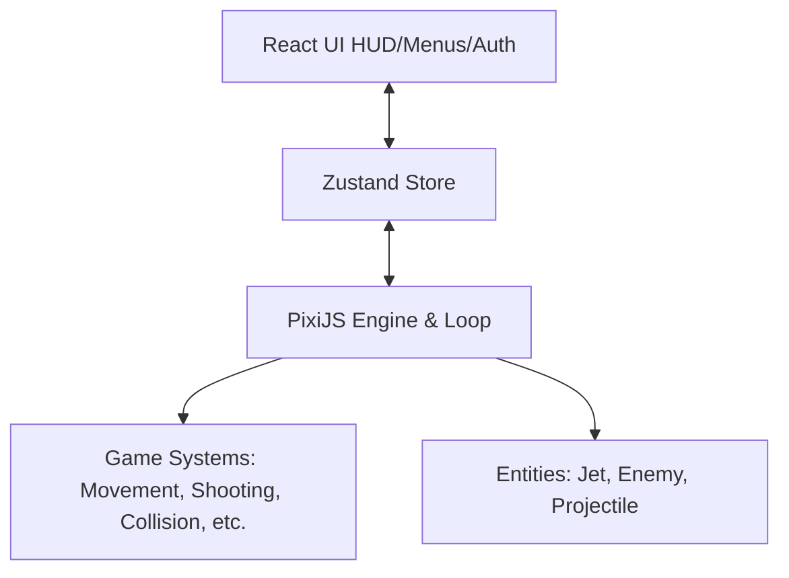

# Air-Pilote — Frontend

2D top-down (cenital) jet game client for **Air-Pilote**.

## Tech Stack

* **Vite** — Dev server and high-performance bundler.
* **React + TypeScript** — UI layer (HUD overlays, menus, and authentication screens).
* **PixiJS (v8)** — Canvas render engine, entity rendering, and manual ticker-driven game loop.
* **Zustand** — State management bridge between the high-performance PixiJS loop and the React DOM UI.
* **Vitest + React Testing Library** — Unit and integration tests.
* **Playwright** — End-to-end user flow testing.

---

## Architecture

The project implements a decoupled architecture separating the high-frequency game engine from the React DOM UI layer:



1. **PixiJS Game Loop & Engine (`src/game/engine/`)**
   * Configures a manual `PIXI.Application`.
   * Manages game phases, entity containers, rendering logic, and handles the update lifecycle of systems.
2. **Entities & Systems (`src/game/entities/` & `src/game/systems/`)**
   * **Entities**: Core game objects (`Jet`, `Enemy`, `Projectile`) inheriting from container primitives.
   * **Systems**: Stateless logic modules (`MovementSystem`, `ShootingSystem`, `CollisionSystem`, `SpawnSystem`, `EnemyAISystem`) acting upon groups of entities.
3. **Zustand State Bridge (`src/game/state/`)**
   * Connects the per-frame engine updates and React's reactivity.
   * **Pixi to React**: Pixi publishes status (current score, health, game over phase) to the store to trigger HUD re-renders.
   * **React to Pixi**: React writes user configuration and navigation commands (start, restart, pause) into the store, which Pixi subscribes to.
4. **React DOM Overlay (`src/ui/`)**
   * Mounts over the canvas to display menus, authentication screens, high scores, and HUD overlays (health bar, score count).
   * Includes a custom API client for interacting with the backend.

---

## Directory Structure

```bash
src/
├── game/                      # Core game logic
│   ├── engine/                # PixiJS Application, Ticker & lifecycle managers
│   ├── entities/              # Game objects (Jet, Enemy, Projectile)
│   ├── input/                 # Keyboard & control handlers
│   ├── state/                 # Zustand store & bridges
│   └── systems/               # Movement, shooting, collision, and spawn systems
├── ui/                        # HUD, menus, routing, and HTTP API client
│   ├── api/                   # API client with token refresh & interception
│   ├── hud/                   # Head-up display (health, score, combos)
│   └── screens/               # Auth, Menu, Paused, and GameOver overlays
├── App.tsx                    # Main app coordinator (screen router)
└── main.tsx                   # Mounting entrypoint
```

---

## Development

### Prerequisites
Make sure you have [pnpm](https://pnpm.io/) installed.

### Setup and Running

1. **Install Dependencies**:
   ```bash
   pnpm install
   ```

2. **Run Development Server**:
   ```bash
   pnpm dev
   ```

3. **Build for Production**:
   ```bash
   pnpm build
   ```

---

## Testing

* **Unit & Integration Tests (Vitest)**:
  ```bash
  pnpm test
  ```

* **E2E Tests (Playwright)**:
  ```bash
  pnpm test:e2e
  ```
